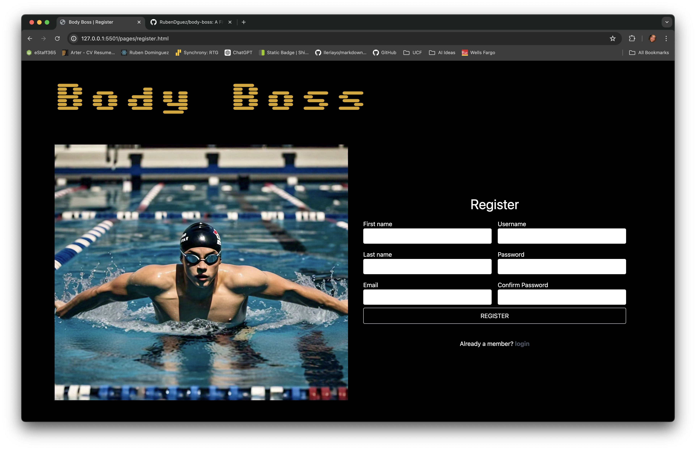
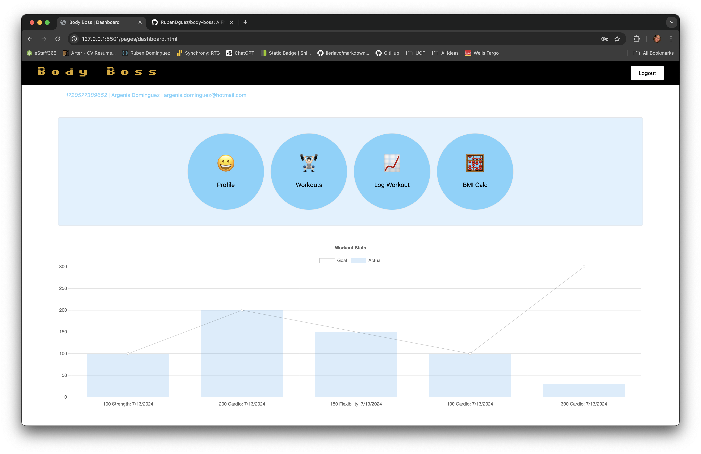

# Body Boss

A comprehensive fitness tracking web application designed to help users manage their workouts, track progress, and stay motivated. 

### Motivation
The motivation behind this project was to create an accessible and user-friendly platform for fitness enthusiasts to track their exercise routines and monitor progress over time.

### Why Build This Project?
We built Body Boss to address the lack of a cohesive, easy-to-use fitness tracking tool that integrates various features such as progress tracking, workout planning, and motivational resources in one place.

### Problem It Solves
Body Boss solves the problem of scattered and inconsistent fitness tracking by providing a centralized hub for all fitness-related activities. It ensures users can track their progress, set goals, and stay motivated.

### What Did We Learn?
During the development of Body Boss, we learned about the intricacies of client-side storage, the importance of responsive design, and the effectiveness of using CSS frameworks for rapid development. We also gained insights into user experience design and the importance of intuitive interfaces.

## Table of Contents (Optional)

- [Installation](#installation)
- [Usage](#usage)
- [Credits](#credits)
- [License](#license)
- [Features](#features)
- [How to Contribute](#how-to-contribute)

## Installation

1. Clone the repository:
    ```sh
    git clone https://github.com/RubenDguez/body-boss.git
    ```
2. Navigate to the project directory:
    ```sh
    cd body-boss
    ```
3. Open project (using VSCode here):
    ```sh
    code .
    ```

## Usage

1. Select index.html and open the file with the 'Open in Default Browser' VSCode extension.
2. Create an account or log in if you already have one.
3. Set up your profile and start tracking your workouts.

### Screenshots





## Credits

- **Collaborators**:
    - [Argenis Ruben Dominguez](https://github.com/RubenDguez)
    - [Alexander Volkov](https://github.com/sashamolotovs7)
    - [Jarvis Young](https://github.com/Jarvisyoung24)
    - [Isaiah Hadley](https://github.com/ilhadley)

- **Third-Party Assets**:
    - [Tailwind CSS](https://tailwindcss.com/)
    - [Chart.js](https://www.chartjs.org/)

- **Tutorials Followed**:
    - [MDN Web Docs](https://developer.mozilla.org/)
    - [FreeCodeCamp](https://www.freecodecamp.org/)

## License

This project is licensed under the MIT License. See the [LICENSE](LICENSE) file for details.

## Features

- User Authentication
- Workout Tracking
- Progress Monitoring
- Goal Setting
- Interactive Charts

## Tags


## How to Contribute

We welcome contributions! Please follow these guidelines:

1. Fork the repository.
2. Create a new branch (`git checkout -b feature-branch`).
3. Commit your changes (`git commit -m 'Add new feature'`).
4. Push to the branch (`git push origin feature-branch`).
5. Create a new Pull Request.
